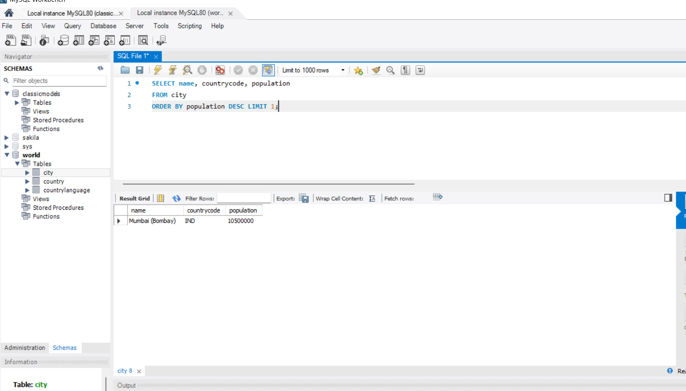

# Week 3 – SQL and Relational Databases  

**Author:** Destiny Noruwa  
**Bootcamp:** 8-Week Data Analyst Programme  
**Workbook Focus:** Relational Database Design | Query Writing | Business Data Management  

---

## Overview  

This workbook developed my ability to **design, build, and query relational databases** using SQL.  
Through a series of structured exercises and a practical business scenario, I learned how to create efficient, scalable data systems for real-world applications such as retail, finance, and customer analytics.  

The work combined theoretical database design with hands-on practice, building a solid understanding of how data is stored, related, and retrieved in professional environments.

---

## Objectives  

- Understand relational database structures and how data relationships are formed  
- Create and normalise database schemas for business use cases  
- Apply SQL queries for selection, filtering, grouping, and aggregation  
- Practise all join types (INNER, LEFT, RIGHT, FULL, SELF, and CROSS JOIN)  
- Write SQL statements to create, populate, and maintain a functional retail database  
- Link SQL queries to real-world data scenarios across commerce and demographics  

---

## Workbook Structure  

| Section | Description |
|----------|-------------|
| **Day 1 – Database Foundations** | Defined key concepts such as primary keys, foreign keys, and relationships (one-to-one, one-to-many, and many-to-many). Compared relational and non-relational databases and explored their use cases. |
| **Day 2 – Database Models** | Analysed the difference between structured and semi-structured data. Reviewed business contexts suited for RDBMS versus NoSQL, including financial transactions and customer behaviour tracking. |
| **Day 3 – SQL Join Operations** | Practised six types of joins to merge datasets and extract insights. Created sample queries to compare customers, orders, and demographic data using INNER, LEFT, RIGHT, FULL, SELF, and CROSS JOINs. |
| **Day 4 – Retail Database Design (Essay Project)** | Designed a full relational schema for a retail business covering products, customers, sales, suppliers, and loyalty programmes. Explained each implementation step with sample SQL commands and integrity rules. |
| **Day 4 – SQL Practical Exercises** | Wrote SQL queries to explore the *world_db* dataset. Tasks included counting cities, identifying top populations, filtering by ranges, listing capitals, and calculating averages. |

---

## Tools and Techniques  

- **MySQL / SQL Server** – Table creation, data manipulation (DDL & DML), joins, filtering, and aggregation  
- **ERD Modelling** – Designing table relationships and enforcing referential integrity  
- **Data Querying and Analysis** – Realistic scenarios from global, retail, and demographic datasets  

---

## Skills Developed  

- Database schema design and normalisation  
- Table creation using `CREATE TABLE` statements  
- Data insertion and population with `INSERT INTO`  
- Data selection and aggregation with `SELECT`, `WHERE`, `GROUP BY`, and `ORDER BY`  
- Advanced joins for combining multiple data sources  
- Query optimisation and efficient retrieval  
- Translating business logic into relational models  

---

## Key SQL Concepts Covered  

- **Primary and Foreign Keys:** Ensured unique identification and consistent relationships between tables.  
- **Joins and Relationships:** Combined customer, order, and city datasets to provide unified analysis.  
- **Aggregations:** Calculated averages, totals, and counts for grouped data such as regional sales or population trends.  
- **Filtering and Sorting:** Applied conditional logic to refine queries and create meaningful reports.  
- **Data Integrity:** Used constraints to enforce reliability and prevent redundancy.  

---

## Project Summary – Retail Database Design  

As part of the coursework, I designed a database for a small corner-shop retail business.  
The system was structured to manage inventory, customer profiles, and sales transactions efficiently.  

### Database Tables  

- **Products:** product_id, barcode, name, category, unit_price, stock_quantity  
- **Customers:** customer_id, name, email, loyalty_number, contact_info  
- **Sales:** sale_id, customer_id, date, total_amount, payment_method  
- **SaleItems:** sale_item_id, sale_id, product_id, quantity, line_total  
- **Suppliers:** supplier_id, company_name, contact_info, lead_time  
- **LoyaltyTx:** loyalty_tx_id, customer_id, points_earned, date  

### Core Relationships  

- Customers → Sales (One-to-Many)  
- Sales → SaleItems (One-to-Many)  
- Products → SaleItems (One-to-Many)  
- Suppliers → Products (One-to-Many)  

This relational design ensures efficient querying, inventory management, and loyalty tracking.  

---

## Insights and Reflections  

- Learned how properly structured data enables accurate, scalable analysis in both business and public-sector contexts.  
- Practised how to translate unstructured requirements into SQL-ready schemas.  
- Understood how relational logic underpins all modern BI tools such as Power BI and Tableau.  

---

## Outcome  

By completing this module, I built a strong foundation in relational database management and analytical querying.  
I can now create, populate, and query databases from scratch — a critical skill for developing finance, health, and digital-inclusion analytics pipelines.

---

## Screenshot / Example  

*Insert your SQL ER diagram, query output, or dataset preview here*  

---
