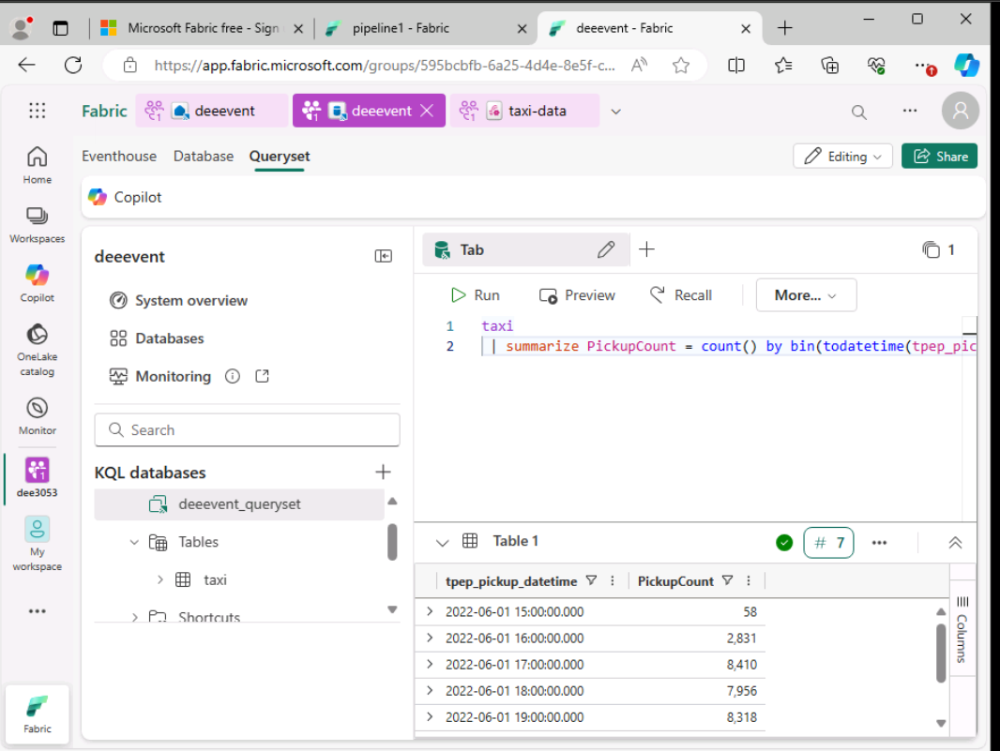

# Week 4 – Azure Cloud for Data Analysis and Engineering  

**Author:** Destiny Noruwa  
**Bootcamp:** 8-Week Data Analyst Programme  
**Workbook Focus:** Cloud Data Architecture | Data Governance | Microsoft Azure  

---

## Overview  

This workbook explored the integration of **data engineering, compliance, and analytics within Microsoft Azure**.  
Through lectures, hands-on research, and scenario-based analysis, I learned how to design a secure, scalable, and compliant cloud infrastructure for business data management.  

The key focus was the **Paws & Whiskers** project — a case study where I proposed an Azure-based solution to replace manual data collection and enable automated analytics, ensuring compliance with UK data protection laws such as **GDPR** and the **Data Protection Act 2018**.  

---

## Objectives  

- Understand the foundations of cloud computing and its real-world applications  
- Learn the differences between IaaS, PaaS, and SaaS  
- Compare public, private, hybrid, and community cloud models  
- Explore major cloud providers (AWS, Azure, Google Cloud) and their core services  
- Design a compliant cloud architecture for data storage, analysis, and automation  
- Integrate **Azure Data Factory**, **Azure SQL Database**, **Data Lake**, and **Synapse Analytics** for business insights  

---

## Workbook Structure  

| Section | Description |
|----------|-------------|
| **Day 1 – Cloud Fundamentals** | Defined cloud computing and compared **on-premises vs cloud** infrastructure. Reviewed providers such as AWS, Azure, and Google Cloud, detailing core functions and advantages. |
| **Day 1 – Service Models (IaaS, PaaS, SaaS)** | Researched service models and identified real-world examples of each (e.g., Azure Virtual Machines, App Engine, Microsoft 365). |
| **Day 1 – Cloud Deployment Models** | Explored public, private, hybrid, and community clouds, discussing where each model fits in real-world organisations such as hospitals, banks, and universities. |
| **Day 2 – Data Security and Laws** | Reviewed the **Computer Misuse Act**, **Police and Justice Act 2006**, and **Copyright Acts**, linking each to digital data management. Summarised what data employers can store under GDPR. |
| **Day 3 – Azure Labs and Data Exploration** | Completed labs exploring **relational, non-relational, and analytical data** using Azure services. Practised integrating structured and unstructured data storage with visualisation tools. |
| **Day 4 – Practice Exam and Case Study** | Worked through the DP-900 (Azure Fundamentals) practice exam, then applied the knowledge to the **Paws & Whiskers** case study, developing a full Azure data strategy. |

---

## Tools and Technologies  

- **Microsoft Azure** – Cloud data storage, compute, and analytics  
- **Azure SQL Database** – Relational data storage for structured information  
- **Azure Data Lake Storage Gen2** – Scalable data storage for large datasets and history logs  
- **Azure Data Factory** – Automated data extraction, transformation, and loading (ETL)  
- **Azure Synapse Analytics** – Enterprise-scale data integration and analytics  
- **Power BI** – Visualisation of connected Azure data sources  

---

## Skills Developed  

- Cloud Data Modelling and Architecture Design  
- Data Storage and Automation Pipelines (ETL with Azure Data Factory)  
- Secure Data Handling and Encryption in Cloud Environments  
- Data Governance and Compliance under GDPR and DPA 2018  
- Business Case Analysis and Technical Proposal Writing  
- Integration of Analytics Tools (Power BI and Synapse)  

---

## Project Summary – “Paws & Whiskers” Cloud Architecture  

As part of the final task, I designed a secure and scalable cloud solution for **Paws & Whiskers**, a growing pet shop seeking to automate data collection and reporting.  

### 1. Scenario Background  
The company relied on manual spreadsheets to track sales, inventory, and customer information. The goal was to migrate this data into a cloud-based system for centralised access, faster reporting, and enhanced decision-making.

### 2. Data Laws and Regulations  
The design adhered to:  
- **GDPR (UK):** Secure storage, access control, encryption, and right to erasure.  
- **Data Protection Act 2018:** Transparency, purpose limitation, and data accuracy.  
- **PCI DSS and PECR:** Compliance for handling payment and communication data.  

### 3. Azure Service Recommendations  
- **Azure SQL Database** – Central relational data store for transactions and customer data.  
- **Azure Data Lake Storage** – Historical and unstructured data repository for analytics.  
- **Azure Data Factory** – Automated data pipeline to import and transform datasets daily.  
- **Azure Synapse Analytics** – Central data warehouse to model and query combined data.  
- **Power BI Service** – Visual dashboards providing real-time insights into sales, stock, and customer behaviour.  

### 4. Data Modelling  
Designed using a **star schema**, separating dimensions (Customer, Product, Store, Date) from fact tables (Sales, Inventory).  
This approach ensured high performance for analytics and direct compatibility with Power BI.

### 5. Security and Backup Strategy  
- **Encryption at rest and in transit** across all storage layers.  
- **Role-Based Access Control (RBAC)** and **Azure Key Vault** for credential management.  
- **Azure Backup and Geo-Redundant Storage (GRS)** for disaster recovery and data resilience.  

### 6. Data Visualisation  
Integrated **Power BI** directly with Azure SQL and Synapse to visualise KPIs such as daily sales, top-performing products, and customer loyalty trends.

---

## Insights and Reflections  

- Learned how to align cloud design with business compliance and operational goals.  
- Understood how Azure’s scalability supports both structured and unstructured analytics.  
- Experienced how automated ETL pipelines reduce manual workloads and errors.  
- Built confidence in designing cloud strategies that meet both technical and legal standards.  

---

## Outcome  

This module strengthened my understanding of **cloud-based data ecosystems** and their real-world use in finance, retail, and health analytics.  
By combining Azure infrastructure with strong governance principles, I learned to design systems that are **efficient, secure, and compliant** — the core of modern data strategy.

---
