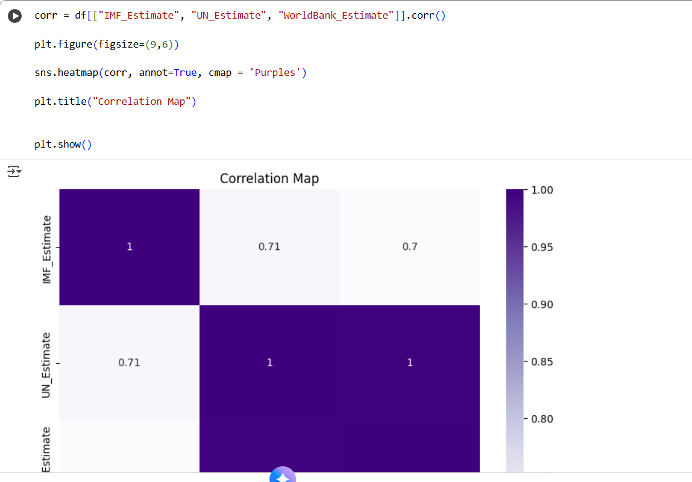

# Week 6 – Python, Pandas, Matplotlib & Seaborn  

**Author:** Destiny Noruwa  
**Bootcamp:** 8-Week Data Analyst Programme  
**Workbook Focus:** Data Manipulation | Data Visualisation | Analytical Programming  

---

## Overview  

This workbook introduced the use of **Python** for real-world data analysis, enabling the automation of tasks previously performed in Excel.  
It focused on building confidence in handling data programmatically  from importing and cleaning datasets with **Pandas** to exploring and visualising trends using **Matplotlib** and **Seaborn**.  

Through hands-on exercises such as **FizzBuzz**, the **Student dataset**, and **GDP (Nominal) per Capita**, I developed strong skills in coding logic, data transformation, and creating polished visual insights.

---

## Objectives  

- Learn Python syntax and build confidence with structured programming  
- Read, clean, and manipulate CSV datasets using **Pandas**  
- Apply indexing, slicing, filtering, and grouping techniques  
- Perform aggregations and transformations to prepare data for analysis  
- Create data visualisations using **Matplotlib** and **Seaborn**  
- Export processed datasets for reporting or further analysis  

---

## Workbook Structure  

| Section | Description |
|----------|-------------|
| **Day 2 – Python Logic Fundamentals** | Created the **FizzBuzz** program to practice conditional statements and loops, developing core problem-solving logic. |
| **Day 3 – Data Loading and Exploration** | Used **Pandas** to read the `student.csv` dataset, inspect rows, and display summary statistics using `.head()`, `.info()`, and `.describe()`. |
| **Exercise 2 – Indexing and Slicing** | Selected specific columns and rows using column indexing, multiple column selection, and conditional filtering. |
| **Exercise 3 – Data Manipulation** | Added new calculated columns, renamed variables, and dropped unused fields. Created a **“passed”** column to flag students meeting performance thresholds. |
| **Exercise 4 – Aggregation and Grouping** | Grouped data by categories such as class and gender to calculate averages and counts, using `.groupby()` and `.agg()`. |
| **Exercise 5 – Advanced Operations** | Built pivot tables in Pandas and applied conditional logic to assign **grades** (A, B, C, D) based on mark ranges. Sorted results in descending order by score. |
| **Exercise 6 – Data Exporting** | Saved transformed data to new CSV files, ensuring reproducibility and sharing capabilities. |
| **Exercise 7 – Visualisation** | Used **Matplotlib** and **Seaborn** to visualise class averages and grade distributions. Created bar charts and scatter plots to explore performance patterns. |
| **Day 4 – GDP per Capita Analysis** | Imported the **GDP (Nominal) per Capita** dataset, displaying specific columns such as *Country/Territory* and *UN_Region*. Created visualisations showing income differences and economic distribution. |

---

## Tools and Libraries  

- **Python 3** – Core programming language  
- **Pandas** – Data manipulation and preparation  
- **Matplotlib** – Custom charting and trend visualisation  
- **Seaborn** – Statistical visualisation and correlation mapping  
- **Jupyter Notebook** – Interactive development environment for analysis  
- **CSV Files** – Primary format for structured data storage and export  

---

## Skills Developed  

- Python Programming Fundamentals (loops, conditions, syntax)  
- Data Cleaning, Transformation, and Structuring in Pandas  
- Grouping, Aggregation, and Pivot Table Creation  
- Automated Reporting through Script-Based Data Processing  
- Visual Analytics with Matplotlib and Seaborn  
- Exporting Clean Datasets for Further BI Integration  

---

## Insights and Findings  

- Built a foundational understanding of **data automation** using Python.  
- Learned how to use code to replace manual Excel operations efficiently.  
- Identified academic performance trends using grouped averages and visual plots.  
- Created economic visuals in the **GDP project**, showing clear income inequality across regions and its link to global development.  

---

## Outcome  

This module marked the transition from spreadsheet-based to code-driven analytics.  
It enhanced my ability to **automate repetitive tasks**, **visualise complex data**, and **prepare clean datasets for advanced BI tools** such as Power BI and Azure Synapse.  
The exercises also deepened my understanding of how economic and educational data intersect in measuring performance and inclusion.

---

